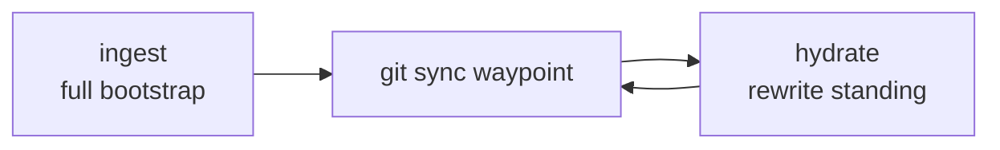

# Agent Skills

Cursor / Claude / Codex skills I actually use — memory sync, shipping PRs, explaining plans, and a vendored Oxlint installer.

**Author:** [Amanjot Singh](https://github.com/amanjotx)

---

## What this is

A small set of agent skills under `skills/<name>/SKILL.md`. Install with the [skills CLI](https://skills.sh/docs/cli), then invoke by name or slash command.

Who it's for: people running Cursor (or Claude / Codex with skills support) who want reusable workflows instead of re-prompting the same ritual every time.

---

## Skills

| Skill         | What it does                                                                               | When to use                                                                |
| ------------- | ------------------------------------------------------------------------------------------ | -------------------------------------------------------------------------- |
| **hydrate**   | Incremental rewrite of the one `{project}-standing` Hydra knowledge source from a git waypoint | After you've already ingested — keep standing current without a full remap |
| **ingest**    | Full bootstrap: one distilled standing document (problem, destination vs code, wiring)     | First time (or reset) for a project — build the memory baseline            |
| **ship**      | Branch from main, conventional commits, push, open a detailed GitHub PR via `gh`           | Ready to land work — want a clean branch + PR, not a dump of diffs         |
| **simply**    | Re-explain plans and designs in plain language, with analogies and simple diagrams         | When a plan is correct but dense — `/simply` until it clicks               |
| **anti-slop** | Vendor [Dillon Mulroy](https://github.com/dmmulroy)'s Oxlint plugin into a TypeScript repo | Adding anti-slop lint rules to a JS/TS project — not this skills repo      |

### hydrate & ingest

These two are a pair. **ingest** writes one `{project}-standing` **knowledge** source (`--no-infer`). **hydrate** rewrites that same id from a git waypoint. Do not spawn sibling ids (`*-codebase-map`, `*-decisions-*`, `*-scars`).

Use the **`hydradb` CLI** (not MCP). Pass `--collection {project}` on every call — never set `HYDRADB_COLLECTION` in the shell profile. Personal prefs live in a `personal` collection, not in project standing.



Both need the [HydraDB CLI](https://docs.hydradb.com/plugins/cli) (`hydradb`). Put `HYDRADB_API_KEY` and `HYDRADB_DATABASE` in `~/.zshenv` (Cursor agents skip `~/.zshrc`). This repo does not ship credentials.

`hydrate` and `ingest` are typically `disable-model-invocation: true` — invoke them explicitly (slash / skill pick), not as silent auto-tools.

### ship

Uses the GitHub CLI (`gh`). Expects you authenticated and in a git repo. Handles the boring parts: branch off main, commit style, push, PR body with enough context to review.

### simply

Slash-command style: `/simply`. Feed it a plan, design, or architecture dump; get back plain language, analogies, and light diagrams.

### anti-slop

Vendored from [dmmulroy/anti-slop](https://github.com/dmmulroy/anti-slop) by [Dillon Mulroy](https://github.com/dmmulroy) (MIT). Original skill name was `install-anti-slop`; the folder here is `anti-slop`.

This skill does **not** lint this repo. Invoke it inside a TypeScript or JavaScript product repo. It copies the bundled Oxlint plugin to `tools/oxlint/anti-slop/`, installs `oxlint` + `@oxlint/plugins`, and wires the config. Do not run the installer against Agent-Skills.

---

## Install

```bash
npx skills add amanjotx/Agent-Skills --all
```

`--all` installs every skill to every detected agent, no prompts. Use `-g` to install globally (user-level, all projects) instead of the current repo:

```bash
npx skills add amanjotx/Agent-Skills --all -g
```

### Selective

Pick a few skills. Skip `hydrate` / `ingest` if you aren't using Hydra DB.

```bash
npx skills add amanjotx/Agent-Skills --skill ship --skill simply --skill anti-slop
```

Preview the repo without installing:

```bash
npx skills add amanjotx/Agent-Skills --list
```

### Individual

```bash
npx skills add amanjotx/Agent-Skills@hydrate
npx skills add amanjotx/Agent-Skills@ingest
npx skills add amanjotx/Agent-Skills@ship
npx skills add amanjotx/Agent-Skills@simply
npx skills add amanjotx/Agent-Skills@anti-slop
```

Same thing with `--skill`:

```bash
npx skills add amanjotx/Agent-Skills --skill ship
```

Do **not** vendor these into other product repos under `.cursor/skills/` — install from this source and keep them personal.

---

## Layout

```
skills/
  hydrate/SKILL.md
  ingest/SKILL.md
  ship/SKILL.md
  simply/SKILL.md
  anti-slop/          # vendored from dmmulroy/anti-slop (Dillon Mulroy)
    SKILL.md
    LICENSE
    scripts/install.mjs
    assets/anti-slop/ # Oxlint plugin copied into TS repos
```

---

## License

[MIT](./LICENSE) © 2026 Amanjot Singh

`skills/anti-slop` is [MIT](./skills/anti-slop/LICENSE) © 2026 [Dillon Mulroy](https://github.com/dmmulroy) — [dmmulroy/anti-slop](https://github.com/dmmulroy/anti-slop).
