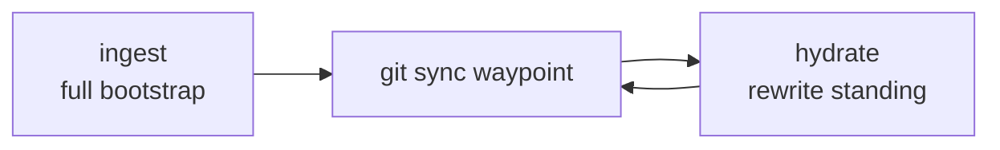

# Skills

Skills I actually use in Cursor, Claude, and Codex — memory, shipping, UI polish, browser automation, and lint setup.

**Author:** [Amanjot Singh](https://github.com/amanjotx)

```bash
npx skills add amanjotx/Skills --all
```

`--all` installs every skill to every detected agent, no prompts. Add `-g` for a user-level (global) install:

```bash
npx skills add amanjotx/Skills --all -g
```

### Selective

Interactive picker for which skills and agents to install. Skip `hydrate` / `ingest` if you aren't using Hydra DB.

```bash
npx skills add amanjotx/Skills
```

### Individual

```bash
npx skills add amanjotx/Skills@hydrate
npx skills add amanjotx/Skills@ingest
npx skills add amanjotx/Skills@ship
npx skills add amanjotx/Skills@simply
npx skills add amanjotx/Skills@anti-slop
npx skills add amanjotx/Skills@agent-browser
npx skills add amanjotx/Skills@better-ui
npx skills add amanjotx/Skills@better-typography
npx skills add amanjotx/Skills@better-colors
npx skills add amanjotx/Skills@make-interfaces-feel-better
```

Or `npx skills add amanjotx/Skills --skill ship`.

Do **not** copy these into other product repos under `.cursor/skills/` — install from this source.

---

## Skills

| Skill | What it does | When to use |
| --- | --- | --- |
| **hydrate** | Incremental rewrite of the one `{project}-standing` Hydra knowledge source from a git waypoint | After ingest — keep standing current without a full remap |
| **ingest** | Full bootstrap: one distilled standing document (problem, destination vs code, wiring) | First time (or reset) for a project |
| **ship** | Branch from main, conventional commits, push, open a detailed GitHub PR via `gh` | Ready to land work |
| **simply** | Re-explain plans in plain language, with analogies and simple diagrams | Plan is correct but dense — `/simply` |
| **anti-slop** | Vendor [Dillon Mulroy](https://github.com/dmmulroy)'s Oxlint plugin into a TS/JS repo | Adding anti-slop lint — not in this skills repo |
| **agent-browser** | Stub for the [agent-browser](https://github.com/vercel-labs/agent-browser) CLI | Browser / Electron / Slack automation — install the CLI first |
| **better-ui** | Radii, shadows, motion, hit areas | UI polish (type → **better-typography**) |
| **better-typography** | Fonts, scale, wrapping, OpenType, text a11y | Anything with text |
| **better-colors** | OKLCH conversion, palettes, contrast, gamut, Tailwind v4 | Color tokens, dark mode, contrast |
| **make-interfaces-feel-better** | Broader polish (surfaces, type, motion, performance) | One “feels off” pass; overlaps **better-ui** |

### hydrate & ingest

A pair. **ingest** writes one `{project}-standing` **knowledge** source (`--no-infer`). **hydrate** rewrites that same id from a git waypoint. Do not spawn sibling ids (`*-codebase-map`, `*-decisions-*`, `*-scars`).

Use the **`hydradb` CLI** (not MCP). Pass `--collection {project}` on every call — never set `HYDRADB_COLLECTION` in the shell profile. Personal prefs live in a `personal` collection. Put `HYDRADB_API_KEY` and `HYDRADB_DATABASE` in `~/.zshenv`. Typically `disable-model-invocation: true` — invoke them explicitly.



### Notes

- **ship** needs `gh` in a git repo.
- **anti-slop** copies into `tools/oxlint/anti-slop/` in a product repo. Do not run the installer against this Skills repo. Vendored from [dmmulroy/anti-slop](https://github.com/dmmulroy/anti-slop) (MIT).
- **agent-browser** loads live docs via `agent-browser skills get core`. Install: `npm i -g agent-browser && agent-browser install`. Vendored stub from [vercel-labs/agent-browser](https://github.com/vercel-labs/agent-browser) (Apache-2.0).
- **better-ui**, **better-typography**, **better-colors** from [jakubkrehel/skills](https://github.com/jakubkrehel/skills) (MIT).
- **make-interfaces-feel-better** from [jakubkrehel/make-interfaces-feel-better](https://github.com/jakubkrehel/make-interfaces-feel-better) (MIT).

---

## License

[MIT](./LICENSE) © 2026 Amanjot Singh

Vendored skills keep their upstream licenses:

- `skills/anti-slop` — [MIT](./skills/anti-slop/LICENSE) © 2026 [Dillon Mulroy](https://github.com/dmmulroy)
- `skills/better-ui`, `better-typography`, `better-colors` — [MIT](./skills/better-ui/LICENSE) © 2026 [Jakub Krehel](https://github.com/jakubkrehel)
- `skills/make-interfaces-feel-better` — [MIT](./skills/make-interfaces-feel-better/LICENSE) © 2026 [Jakub Krehel](https://github.com/jakubkrehel)
- `skills/agent-browser` — [Apache-2.0](./skills/agent-browser/LICENSE) — [vercel-labs/agent-browser](https://github.com/vercel-labs/agent-browser)
